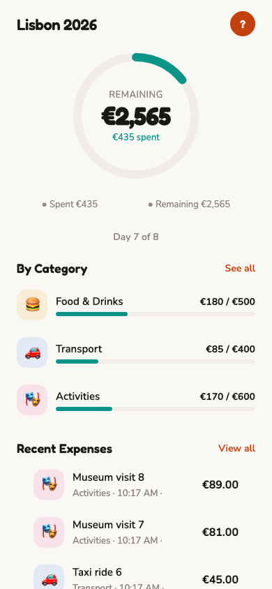
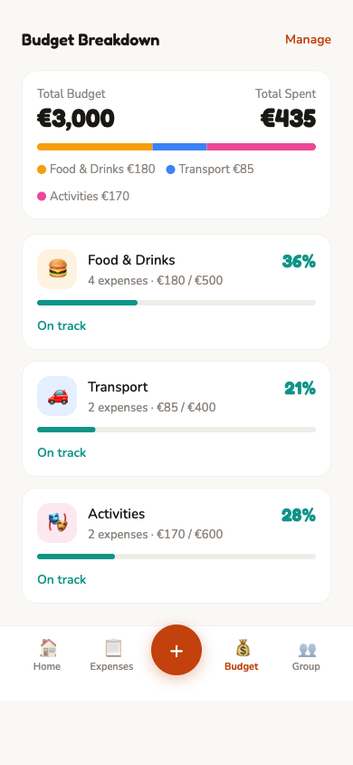
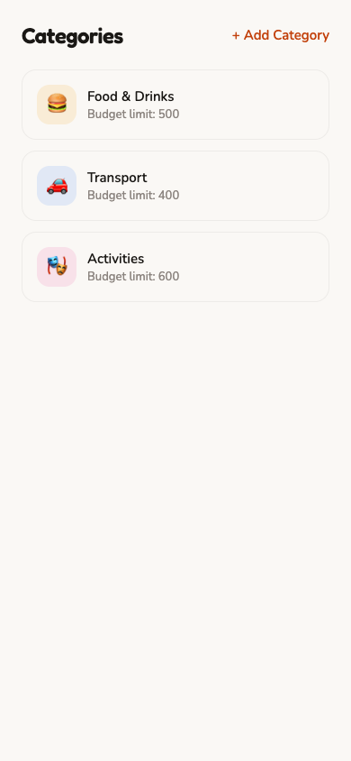
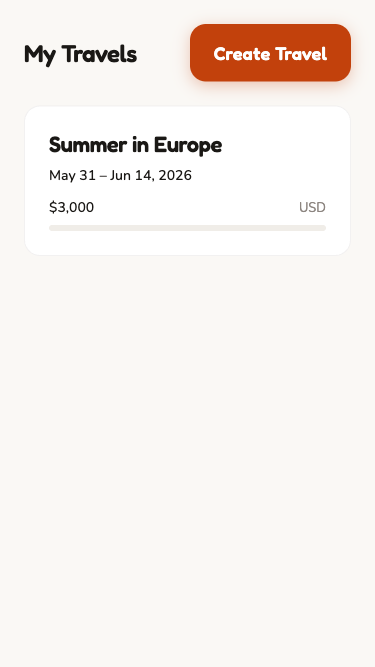
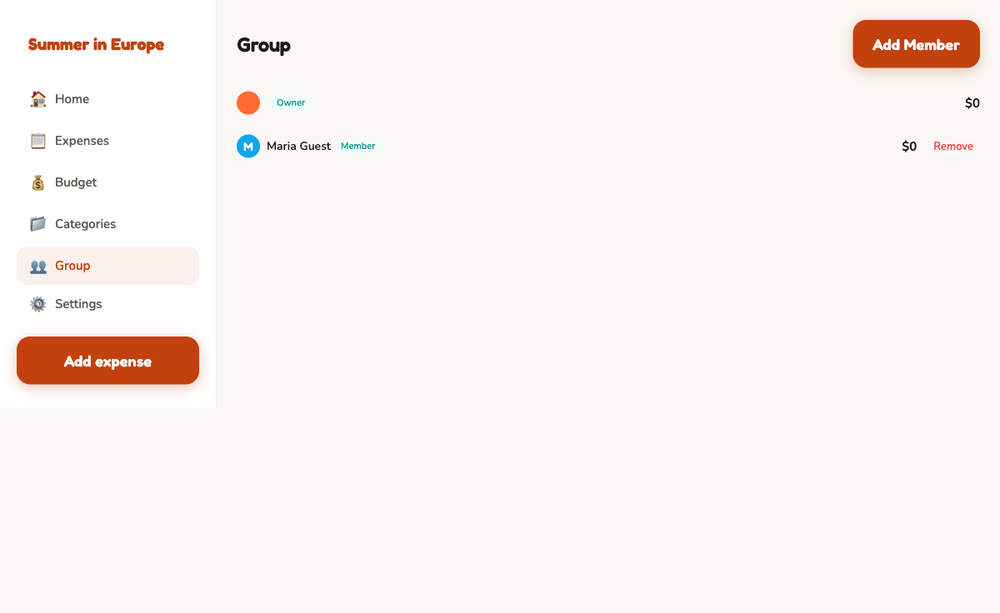

# My Travel Budgets

Full-stack travel budget management app for tracking shared trip expenses. Plan trips, split costs with travel companions, and keep spending under control — all from web or mobile.

Served at **mybudget.cards**

## Screenshots

### Mobile

<p align="center">
  
  &nbsp;&nbsp;
  
  &nbsp;&nbsp;
  
  &nbsp;&nbsp;
  
</p>

### Web

<p align="center">
  
</p>

## Tech Stack

| Layer      | Technology                  |
| ---------- | --------------------------- |
| Monorepo   | Turborepo + pnpm workspaces |
| Web        | React 19 + Vite             |
| Mobile     | Expo (iOS & Android)        |
| Shared UI  | Tamagui                     |
| API        | NestJS 11                   |
| Database   | PostgreSQL + Prisma 7       |
| Validation | Zod (shared schemas)        |
| Auth       | Magic link (passwordless)   |
| Language   | TypeScript (strict)         |

## Project Structure

```
src/
  apps/
    web/            React + Vite web app
    mobile/         Expo mobile app (iOS & Android)
    api/            NestJS REST API + Prisma ORM
  packages/
    core/           Shared Zod schemas, types, and constants
    ui/             Tamagui config and shared components
    api-client/     Typed HTTP client for the API
    typescript-config/  Shared tsconfig presets
```

## Getting Started

### Prerequisites

- **Node.js** >= 20
- **pnpm** >= 9
- **PostgreSQL** running locally (or via Docker)

### Setup

```bash
# Clone the repo
git clone https://github.com/your-username/my-travel-budgets.git
cd my-travel-budgets

# Install dependencies
pnpm install

# Configure environment
cp src/apps/api/.env.example src/apps/api/.env
# Edit .env with your database credentials

# Run database migrations
pnpm db:migrate

# Generate Prisma client
pnpm db:generate

# Start all dev servers
pnpm dev
```

The web app runs on `http://localhost:5173` and the API on `http://localhost:3000`.

### Commands

| Command            | Description                       |
| ------------------ | --------------------------------- |
| `pnpm dev`         | Start all dev servers in parallel |
| `pnpm build`       | Build all apps and packages       |
| `pnpm test`        | Run tests across all workspaces   |
| `pnpm lint`        | Type-check all packages           |
| `pnpm db:generate` | Generate Prisma client            |
| `pnpm db:migrate`  | Run database migrations           |

## Features

- **Trip Management** — Create and organize travel budgets with start/end dates and target currency
- **Shared Expenses** — Track who paid what and split costs between trip members
- **Category Budgets** — Set per-category spending limits (food, transport, accommodation, etc.)
- **Multi-Currency** — Support for 20 currencies with local symbols
- **Guest Members** — Add travel companions even if they don't have an account
- **Passwordless Auth** — Sign in via magic link, no passwords to remember

## Data Model

```
User ──< Travel ──< Category ──< Expense
              └──< TravelMember ──────┘
```

Each travel has members (registered users or guests), categories with optional budget limits, and expenses tied to both a category and the member who paid.

## License

Private project.
